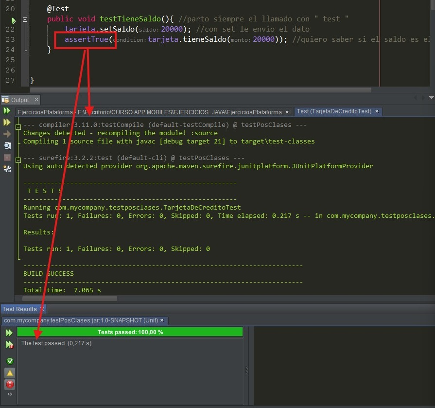
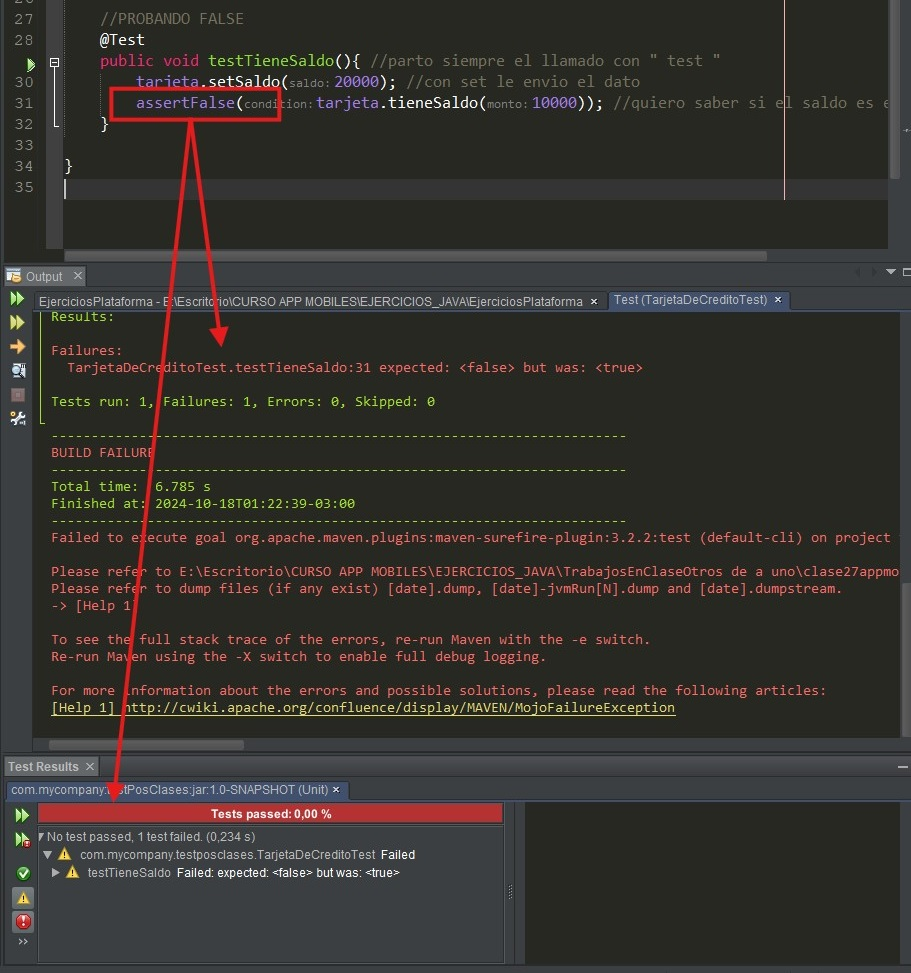
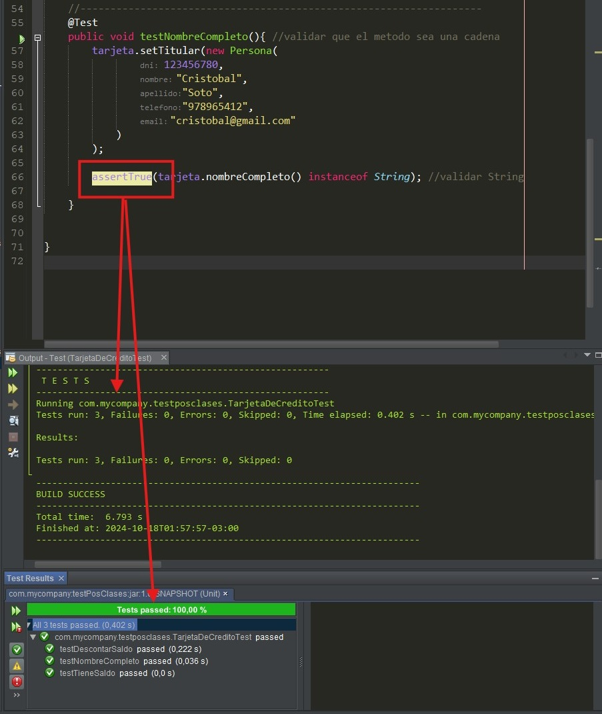
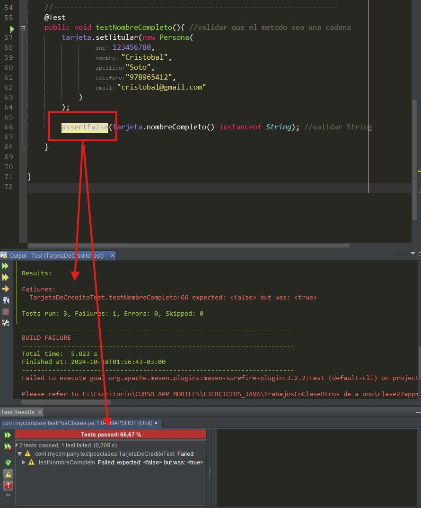

**_<h1 align="center">:vulcan_salute: Ejercicio En Clase Testeo en Ejercicio Pos:computer:</h1>_**
**_<h2 align="center">Módulo 2 - Fundamentos de Programación en Java</h2>_**

- Utilizando los datos del ejercicio Máquina Pos se realizaron test en los metodos del archivo Tarjeta de Crédito.
- Tiene Saldo:

- Nombre Completo tipo String:

